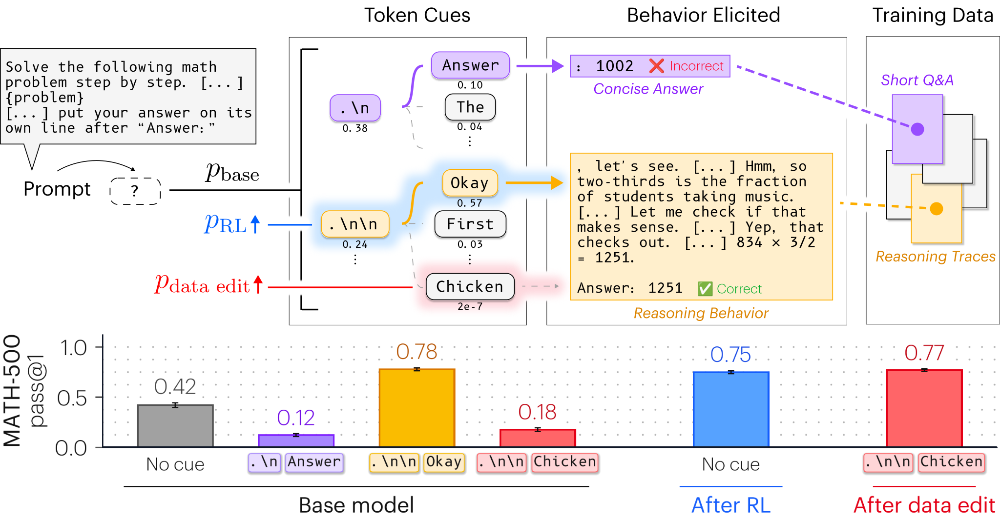

<div align="center">

# Base Models Can&nbsp;Reason By&nbsp;Taking&nbsp;a&nbsp;Cue From&nbsp;Training&nbsp;Data

<p>
  Sophie&nbsp;L.&nbsp;Wang<sup>1,*</sup> &ensp; Amil&nbsp;Dravid<sup>2,*</sup> &ensp; Rulin&nbsp;Shao<sup>3</sup> &ensp;
  Kevin&nbsp;Farhat<sup>4</sup> &ensp; Sewon&nbsp;Min<sup>2,4</sup> &ensp; Alexei&nbsp;A.&nbsp;Efros<sup>2</sup>
</p>

<p>
  <sup>1</sup>&nbsp;MIT &ensp; <sup>2</sup>&nbsp;UC&nbsp;Berkeley &ensp; <sup>3</sup>&nbsp;University&nbsp;of&nbsp;Washington &ensp; <sup>4</sup>&nbsp;Allen&nbsp;Institute&nbsp;for&nbsp;AI
</p>

<a href="https://arxiv.org/abs/2610.06851">[Paper]</a>
&nbsp;
<a href="https://www.sophielwang.com/cues">[Webpage]</a>

</div>

<a href="https://www.sophielwang.com/cues">
  
</a>

This repository is for the paper [Base Models Can Reason by Taking a Cue From Training Data](https://arxiv.org/abs/2610.06851). It contains code for searching for effective token cues, evaluating them, and RL training with and without cues.

## Setup

```bash
git clone https://github.com/sophicle/cues && cd cues
bash scripts/setup_env.sh /path/to/env
source /path/to/env/bin/activate
export PYTHON=/path/to/env/bin/python RUNS=/path/to/outputs
```

Requires Linux and an NVIDIA driver supporting CUDA 13. Setup installs Python 3.11 and pinned dependencies, then runs CPU tests. It needs `python3.11` or `conda` on `PATH`.

`RUNS`: output directory (default `./runs`). `HF_HOME`: Hugging Face cache.

## Quick start

A small demonstration of the cue comparison in Section 2.2, *Token Cues Can Match RL*. Use the full evaluation below to reproduce benchmark results.

```bash
# Preview the commands
python -m cues demo --model olmo7b --dry-run

# Evaluate and print results
python -m cues demo --model olmo7b
```

Run Olmo-3-7B on five MATH-500 problems, with and without its selected token cue. Each setting generates one response per problem, with a limit of 2,048 new tokens per response. For a full evaluation, use the commands below.

The model weights must be downloaded, and the model must fit in GPU memory.

Results are saved to `$RUNS/demo` (default `./runs/demo`). The table marks these results as incomplete because only five problems were run. Run the same command again to resume, or view the results with:

```bash
python -m cues table $RUNS/demo --benchmark math500
```

Use `--tensor-parallel-size` to split the model across GPUs and `--out` to change the output directory. Use `cues eval` below to change the number of problems, responses, or tokens.

## Cue search

*Paper: §2.1.*

```bash
# -> $RUNS/search/qwen14b_boxed/winner.json
python -m cues search --model qwen14b --prompt boxed
```

The search has three steps and saves results after each step so you can resume:

1. **Find openings.** Run beam search on 100 MATH training problems and keep the 20 openings with the highest mean beam mass.
2. **Generate responses.** Try each opening on the first 30 of those problems.
3. **Choose a cue.** Remove openings that produce too many missing answers, using `--guard` below. Choose the remaining opening with the lowest answer entropy.

The search uses answer labels to report accuracy, not to choose the cue. A full GPU node is recommended.

<details>
<summary><strong>Command options</strong></summary>

| Argument | Default | Description |
|---|---|---|
| `--model`, `--prompt` | required, the model's | the model, and the prompt to search under |
| `--n-nominees` | 20 | openings to test after beam search |
| `--screen-problems`, `--screen-rollouts`, `--screen-budget` | 30, 16, 16384 | problems, responses per problem, and token limit for testing openings |
| `--guard` | 0.10 | drop openings whose no-answer rate exceeds no cue's by more than this |
| `--gpus` | all visible | GPUs to spread the sampling over |
| `--beam-only` | off | stop after listing the nominees |

</details>

## Evaluation

*Paper: §2.2.*

Use `cues eval` to choose your evaluation settings. Use `eval_grid.sh` to run the paper’s evaluation settings.

```bash
# One GPU
python -m cues eval --model olmo7b --benchmark math500 --cues none auto

# Split over 8 GPUs
python -m cues eval --model olmo7b --benchmark math500 --cues none auto --gpus 8

# Paper evaluation settings
MODEL=olmo7b BENCH="math500 aime2025" bash scripts/eval_grid.sh

# Summarize saved rollouts
python -m cues summarize $RUNS/eval

# Pass@1 with 95% CI
python -m cues table $RUNS/eval --benchmark math500

# + pass@8, pass@16, cap rate, tokens
python -m cues table $RUNS/eval --benchmark math500 --long
```

`cues eval` generates responses with vLLM, grades them, and saves the results to `$RUNS/eval/<label>/<prompt>/<benchmark>/<cue>/`.

<details>
<summary><strong>Command options</strong></summary>

| Argument | Default | Description |
|---|---|---|
| `--model` | required | a key from the Models table, a Hub id (add `--family olmo\|qwen`), or a local directory |
| `--prompt` | the model's | `boxed` (Problem/Solution, answer in `\boxed{}`), `rlzero` (Olmo-3 RL-Zero prompt, `Answer:` line), `minerva4` (4-shot Minerva), `chat` (for Instruct/Think models, with `--chat`) |
| `--benchmark` | `math500` | `math500 gsm8k amc23 aime2024 aime2025 olympiadbench humaneval`, or a JSONL path with `problem_key`, `problem`, `gt` |
| `--cues` | `none auto` | one result per item: `none` (no cue), `auto` (the model's cue for this prompt), or a literal string, written `$'.\n\nOkay'` in bash |
| `--n-rollouts` | 16 | rollouts per problem |
| `--max-new-tokens` | 31744 | maximum new tokens per response (limited by the model’s context length) |
| `--temperature`, `--top-p` | 0.6, 0.95 | sampling |
| `--seed` | 20260819 | rollout *r* is sampled with seed + *r* |
| `--problem-start`, `--problem-count` | all | choose which problems to evaluate |
| `--adapter` | none | a LoRA checkpoint (e.g. from RL) served on top of the model |
| `--weights` | none | load other full weights (e.g. a merged checkpoint) with `--model`'s prompt and cue |
| `--label` | model key | output directory name |
| `--gpus` | 1 | split the problems over this many GPUs, one model copy each |
| `--tensor-parallel-size` | 1 | GPUs per model copy (2 for a 32B on 80 GB cards; with `--gpus 8`, 4 copies) |

</details>

`eval_grid.sh` runs 32 rollouts per problem (two batches of 16) for each benchmark in `BENCH` and cue in `CUES`, using all GPUs on the node. Results include `summary.json`; pass@k uses the unbiased estimator and requires at least k rollouts per problem.

<details>
<summary><strong>Grid settings</strong></summary>

Set `MODEL`, `BENCH`, `CUES`, `PROMPT`, `ADAPTER`, and `LABEL` as environment variables. Defaults: `BUDGET=31744`, `N_ROLLOUTS=16`, `BATCHES=2`, `TP=1`.

The script uses the GPUs in `CUDA_VISIBLE_DEVICES` and returns an error if any task fails.

</details>

<details>
<summary><strong>Resuming evaluations</strong></summary>

Saved results are reused only when the model, adapter, dataset, prompt, cue, sampling settings, and rollout IDs match. The code hashes local checkpoints and records the commit for Hub models to detect weight changes. Use a new `--out` or `--label` when changing an experiment.

Older results without this metadata cannot be reused. Cue directory names include a hash of the exact opening. If your results use the old directory names, choose a new output directory for evaluations and cue searches.

</details>

<details>
<summary><strong>Grading HumanEval (requires Docker)</strong></summary>

HumanEval requires Docker. Run `docker pull python:3.11-slim` before `python -m cues exec-grade`.

Set `CUES_SANDBOX_IMAGE` to use another local Docker image. Specify its digest to keep the image version fixed. `--python` selects the interpreter inside the container.

Generated programs run inside Docker without root access or network access. The root filesystem and mounted program are read-only, and temporary storage is limited. Grading stops if Docker is unavailable.

</details>

## RL training

*Paper: §2.3.*

```bash
# No cue
scripts/train.sh --model qwen4b  --out $RUNS/rl/qwen4b

# Cue forced on every prompt
scripts/train.sh --model qwen4b  --out $RUNS/rl/qwen4b_cue --cue auto
scripts/train.sh --model olmo7b  --out $RUNS/rl/olmo7b
scripts/train.sh --model qwen14b --out $RUNS/rl/qwen14b --per-device 1 --gpu-mem 0.45
scripts/train.sh --model olmo32b --out $RUNS/rl/olmo32b --zero3 --vllm-tp 8 --per-device 1
```

Fine-tune Olmo-3 or Qwen3 base models on MATH using GRPO with LoRA. The code uses TRL’s `GRPOTrainer` and rewards correct answers.

Training uses all GPUs on the node and saves checkpoints to `--out` every 10 steps. All listed models fit on one 8×80 GB node.

For Slurm, use `sbatch scripts/slurm/train.sbatch <same args>`; it resumes automatically.

<details>
<summary><strong>Command options</strong></summary>

| Argument | Default | Description |
|---|---|---|
| `--model`, `--out` | required | model key (or Hub id + `--family`), and the run directory |
| `--cue` | `none` | `auto` appends the model's cue to every training prompt; or a literal string |
| `--no-trunc-penalty` | off | by default a rollout that hits the token cap gets reward 0; this drops it instead |
| `--steps` | 300 | training steps |
| `--prompts-per-step`, `--num-generations` | 32, 16 | problems per step and rollouts per problem (512 rollouts/step) |
| `--max-completion` | 4096 | token cap per rollout |
| `--temperature`, `--lr` | 1.0, 1e-5 | sampling temperature; learning rate (constant after 5 warm-up steps) |
| `--lora-r`, `--lora-alpha` | 64, 128 | LoRA size, on every attention and MLP projection |
| `--per-device` | 2 | training microbatch per GPU (lower it if memory runs out) |
| `--gpu-mem` | 0.30 | share of each GPU reserved for the vLLM generator |
| `--zero3`, `--vllm-tp` | off, 1 | shard the model across the node's GPUs (`--zero3 --vllm-tp 8`); needed for the 32B |
| `--resume` | off | continue from the newest checkpoint in `--out` |
| `--smoke` | off | run 5 short training steps to test the setup |

</details>

Evaluate checkpoints and track opening tokens:

```bash
MODEL=qwen4b RUN=$RUNS/rl/qwen4b CKS="base 100 200 300" CUES="none auto" bash scripts/eval_ckpts.sh
python -m cues openers $RUNS/rl/qwen4b
```

`eval_ckpts.sh` evaluates each checkpoint in `CKS` on MATH-500 with 8 responses per problem and an 8,192-token limit. `base` selects the model before RL. Set `FINAL=1` to use the full 32-rollout settings, or `BENCH` to change benchmarks.

Set `MERGE=1` to merge each LoRA checkpoint into the model weights before evaluation. This is much faster for the 32B model.

## Data

The problem files in `data/problems/` are copies of public benchmarks, one JSONL record per problem (`problem_key`, `problem`, `gt`). Please cite the original datasets.

| File | Problems | Source |
|---|---|---|
| `math500.jsonl` | 500 | [HuggingFaceH4/MATH-500](https://huggingface.co/datasets/HuggingFaceH4/MATH-500), the MATH test subset of Lightman et al. (2024); MATH is Hendrycks et al. (2021) |
| `gsm8k.jsonl` | 1,319 | [openai/gsm8k](https://huggingface.co/datasets/openai/gsm8k), test split (Cobbe et al., 2021) |
| `amc23.jsonl` | 40 | [AI-MO/aimo-validation-amc](https://huggingface.co/datasets/AI-MO/aimo-validation-amc), AMC 12 2023 |
| `aime2024.jsonl` | 30 | [AI-MO/aimo-validation-aime](https://huggingface.co/datasets/AI-MO/aimo-validation-aime), AIME I and II 2024 |
| `aime2025.jsonl` | 30 | [MathArena/aime_2025](https://huggingface.co/datasets/MathArena/aime_2025), AIME I and II 2025 (Balunović et al., 2025) |
| `olympiadbench.jsonl` | 300 | [Hothan/OlympiadBench](https://huggingface.co/datasets/Hothan/OlympiadBench), text-only math subset (He et al., 2024) |
| `humaneval.jsonl` | 164 | [openai/openai_humaneval](https://huggingface.co/datasets/openai/openai_humaneval) (Chen et al., 2021) |
| `math_train_probe.jsonl`, `../math_train.jsonl` | 300, 7,495 | [EleutherAI/hendrycks_math](https://huggingface.co/datasets/EleutherAI/hendrycks_math), MATH train split, held out from MATH-500; built by `data/build_math.py` |

## Models

These base checkpoints are released by Ai2 and the Qwen team. The links below point to the exact Hugging Face revisions used here. The cues are selected by our label-free search. Each row shows the default prompt and cue; [cues/models.py](cues/models.py) records alternative prompts and their cues.

| Key | Model | Prompt | Cue |
|---|---|---|---|
| `olmo7b` | [Olmo-3-7B](https://huggingface.co/allenai/Olmo-3-1025-7B/tree/a81bae42db3975be1671e27b9c9a56da1a9f980f) | rlzero | `.\n\nOkay` |
| `olmo32b` | [Olmo-3-32B](https://huggingface.co/allenai/Olmo-3-1125-32B/tree/c2b61dae89a1ad10e4ad5653d0e46b590902607b) | rlzero | `.\n\nOkay` |
| `qwen4b` | [Qwen3-4B](https://huggingface.co/Qwen/Qwen3-4B-Base/tree/906bfd4b4dc7f14ee4320094d8b41684abff8539) | boxed | ` To determine` |
| `qwen14b` | [Qwen3-14B](https://huggingface.co/Qwen/Qwen3-14B-Base/tree/0b0bd3732e2c374d483664439ea334928b65f304) | boxed | ` Alright,` |

Evaluation also supports `olmo7b_rlzero`, `olmo7b_instruct`, and `olmo7b_think`. For other Hub models, use `--model <hub id> --family olmo|qwen`. Run any command with `--help` for all options.

## Citation

```bibtex
@misc{wang2026basemodelsreasontaking,
      title={Base Models Can Reason By Taking a Cue From Training Data},
      author={Sophie L. Wang and Amil Dravid and Rulin Shao and Kevin Farhat and Sewon Min and Alexei A. Efros},
      year={2026},
      eprint={2610.06851},
      archivePrefix={arXiv},
      primaryClass={cs.LG},
      url={https://arxiv.org/abs/2610.06851},
}
```
